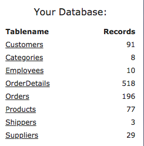

# intro to SQL  

## short URL to this repo [sqlrepo.sage.codes](https://github.com/sagecodes/into-to-sql)

## Do these things first!

- Open your web browser. I'll be using [chrome](https://www.google.com/chrome/), but feel free to use your whatever your favorite browser is. 
- to speed up learnnig we're going to use an [online editor and database](https://www.w3schools.com/sql/trysql.asp?filename=trysql_select_all) for SQL from [W3Schools](https://www.w3schools.com/). 
 
## What this workshop is

A super friendly introduction to SQL No previous experience expected! 

You can't learn EVERYTHING in ~2 hours. But you can learn enough to get excited and comfortable to keep working and learning on your own! Come to our almost weekly code hours [meetups](https://www.meetup.com/Learn-Code-Seattle/events/) to ask questions if you get stuck and show off what you've been working on!

- This course is for absolute beginners
- Ask Questions!
- Answer Questions!
- Help others when you can
- Its ok to get stuck, just ask for help!
- Feel free to move ahead
- Be patient and nice


## About me:
Hello I'm [Sage Elliott](http://sageelliott.com/). I'm a Technology Evangelist at Galvanize Seattle. Previously I've worked as a software and hardware engineer with Startups and Agencies in Seattle, WA and Melbourne, FL. I love technology! I'm currently learning more about how to build AI and VR projects! 

- Website: [sageelliott.com](http://sageelliott.com/)
- Twitter: [@sagecodes](https://twitter.com/@sagecodes)
- LinkedIn: [sageelliott](https://www.linkedin.com/in/sageelliott/) 
- Email: [sage.elliott@galvanize.com](mailto:sage.elliott@galvanize.com)


## About you!

Give a quick Intro!

- Whats your name?
- Whats your background?
- Why are you interested in SQL and data?

## Why is data important

### What is Data?
Data is information. Imagine a phonebook with hundreds of people and businesses.

### What is a Databases?

A database is computerized storage of data. Imagine an organized digital collections of the same people and businesses from the above phone book.

###### Examples

Examples of products using databases.

- Dynamic sites
	- Facebook
	- Gmail  
- Mobile apps
	- Uber
	- Snapchat 
- Data for recommendations
	- Netflix
	- Amazon products
- Item Tracking
	- Library
	- UPS

Some Professional Roles that work with databases:

- Web Developer
- Data Analysist
- Data scientist
- Database Admin


## What is SQL?

Pronounced `S` `Q` `L` or Sequel. Either way is fine!

SQL stands for Structured Query Language

When we return and search data from a database we call it Querying.

Common SQL Databases:

Each of these databases can be Queried using the SQL programming Language.

- MySQL
- PostgreSQL
- Microsoft SQL
- SQLite 
- Oracle

*Note:* There are some slight differences to each database, but most of the SQL commands we're going to cover will be the same or very similar.


Some other popular databases to keep an eye out for as you continue to learn:

- MongoDB
- Couchbase
- Redis

These are often referred to noSQL databased. Read more about noSQL [here](https://www.mongodb.com/nosql-explained)


<!--#### Where SQL used?

#### What is an ORM?

ORM stands for Object relation model
-->


## What is a relational database?

Two major components in a database

Data(Information Stored) and Schema(How the data is organized)

Sections are called tables


##### Tables
You can think of tables as spreadsheets:


| Column ↓  | Column ↓   |  Column ↓  |
|---|---|---|
| Row →   |   |   | 
| Row →   |   |   |
| Row →   |   |   | 

##### Table Organization

Usually separate tables contain data for a specific type of thing:

If we look at [w3schools](https://www.w3schools.com/sql/trysql.asp?filename=trysql_select_all) again you can see all the different tables in the database




Orders table:

| OrderID  |  	CustomerID | 	EmployeeID  | OrderDate  |  ShipperID |
|---|---|---|---|---|
| 10248  | 90  |  5 | 1996-07-04  | 	3  |
| 10249  |  81 |  6 |  1996-07-05 |  1 |
|  10250 | 34  | 4  |  1996-07-08 |  2 |


Products Tables:

| ProductID  | ProductName  | SupplierID  | CategoryID  |  Unit | Price|
|---|---|---|---|---|---|
| 1  |  Chais |  1 |  1 |  10 boxes x 20 bags | 18  |
|  2 |  Chang |  1 |  1 | 24 - 12 oz bottles  | 19 |
|  3 | Aniseed Syrup  | 1  | 2  |  12 - 550 ml bottles | 10  |


<!--Filter data table example:

Rearrange table example:-->


*Note:* When we query this isn't actually changing the database. You're just choosing what and how to look at the data.

The same database can be used in different ways across applications at the same time.

- Website could be pulling data to show your purchase history
- An analyst could be pulling the data to learn what the most popular item is


### Data types

data types for table columns are defined in the schema

The most common data types are:

- Text (Names, Descriptions)
- Numeric (cost, age, weight, quantity)
- Dates (Dates and time)

Its important to have the correct data type for your data. This ensures that sorting and calculations work properly.

*Note:* Data types may change depending on which database you're using.


We could spend a whole workshop discussing databases, but we're going to focus on querying language SQL for the remainder of this workshop. 

Learn more about databases on your own [here](https://www.w3schools.com/sql/sql_create_db.asp)!

If you would like to see a workshop more focused on Databases and how create them let me know!


## lets do some SQL!

Visit [w3schools](https://www.w3schools.com/sql/trysql.asp?filename=trysql_select_all) and navigate to the SQL section.


### Querying

Import first step is to understand your data.

- How is it structured?
- What does it represent?


Lets do some different types querying. 

Lets take a look at all the categories of products we have

`SELECT * FROM Categories`

Lets see how many customers do we have?

`SELECT COUNT(*) FROM Customers`

Lets take a look at our orders

`SELECT * FROM Orders`

Lets rearrange the orders by date

```
SELECT * FROM Orders
ORDER BY OrderDate DESC
```
ASC = Ascending
DESC = Descending

Neat! Lets see which customer made that top order (most recent)! We will take the value from the CustomerID column.

```
SELECT * FROM customers
WHERE CustomerID = '66'
```

Cool! We can also query for matches in multiple columns

```
SELECT * FROM OrderDetails
WHERE ProductID = '14' AND 	Quantity <'10'
```

We can also filter columns by more than one value.

```
SELECT * FROM OrderDetails
WHERE ProductID = '14' OR ProductID='42'
```


So far we have been returning all the columns of a record that match our query. What if we want to only look at a few of them? 

Instead of using `*` to select all we can put in the specific columns we want returned. We can also put them in different order!

```
SELECT Country, city, CustomerName FROM Customers
```
Lets order by Ascending order (A-Z) of Country Name

```
SELECT Country, city, CustomerName FROM Customers
ORDER BY Country ASC;
```

Lets See just a list of countries 
Using `DISTINCT` will just return one instance.

Run the query below with and without `DISTINCT` to see the difference.

```
SELECT DISTINCT Country FROM Customers
ORDER BY Country ASC;

```


Sometimes we want to filter by records that contain values or characters that are not an exact match.

What customers have a name starting with `A`?

```
SELECT * FROM Customers
WHERE CustomerName LIKE 'A%'
```

- 'A%' Starts with an A
- '%A' Ends with an A
- '%A%' Contains an A


- SUM `SELECT SUM(Quantity) FROM OrderDetails`
- MAX `SELECT ProductID, ProductName, MAX(Price) FROM Products`

### Joins

Joins can be a bit trick to understand, so don't worry if you don't quite get it! read and practice them further [here](https://www.w3schools.com/sql/sql_join.asp)

Return combined table

```

SELECT Orders.OrderID, Customers.CustomerName, Orders.OrderDate, OrderDetails.ProductID, Products.productName, Products.Price
FROM Orders
JOIN Customers ON Orders.CustomerID=Customers.CustomerID
JOIN OrderDetails ON Orders.OrderID=OrderDetails.OrderID
JOIN Products ON OrderDetails.ProductID=Products.ProductID
```
By default when you just use 'join' we are creating a inner join. Read more about different joins [here](https://www.w3schools.com/sql/sql_join.asp)
.

Find a helpful graph on joins [here](https://stackoverflow.com/questions/565620/difference-between-join-and-inner-join).


#### Group by

Instead of getting each row, sometimes we want to group them by 

```
SELECT COUNT(ShipperID), ShipperID FROM [Orders]
GROUP by ShipperID
```


Lets do something useful with grouping. Lets find out which shipper has been used the most.

```
SELECT COUNT(Orders.ShipperID), Orders.ShipperID, Shippers.ShipperName
FROM [Orders]
JOIN Shippers ON Orders.ShipperID=Shippers.ShipperID
GROUP by Orders.ShipperID
ORDER BY COUNT(Orders.ShipperID) DESC
```

## Questions
Knowing what we just learned lets try to answer some questions about our data!

- How many items have we shipped?
- What is the most expensive item?
- What is the most popular item?
- Which customer has spent the most money?
- Which customer has returned the most?
- Whats the most popular category?


## Keep Learning!!!


Resources:
- [w3schools](https://www.w3schools.com/sql/)
- [sqlzoo](https://sqlzoo.net/)
- [Datacamp](https://www.datacamp.com/courses/intro-to-sql-for-data-science)
- [mimo](https://getmimo.com/) Mobile app

## Upcoming Events!
We host sooo many events! check out out [calendar](https://www.galvanize.com/seattle/events)

[Learn code](https://www.meetup.com/Learn-Code-Seattle/events/). Thats this meetup! We do workshops and community programming nights! 

Upcoming Learn to code [events](https://www.meetup.com/Learn-Code-Seattle/events/):

- [Intro to Javascript](https://www.meetup.com/Learn-Code-Seattle/events/253466275/) - 9/06 6:30pm
- [Intro to Git and GitHub](https://www.meetup.com/Learn-Code-Seattle/events/253466429/) - 9/19 6:30pm
- [More!!!](https://www.meetup.com/Learn-Code-Seattle/events/)

## What is Galvanize?
###### We are a community!
#### Immersive Bootcamp
- [Data Science](https://www.galvanize.com/seattle/data-science)
- [Web Development](https://www.galvanize.com/seattle/web-development)

#### Part-Time Courses
- [Data Analytics](https://www.galvanize.com/seattle/data-analytics)
- [Web Development Foundations with JavaScript](https://www.galvanize.com/seattle/web-development-foundations)
- [Data Science Fundamentals](https://www.galvanize.com/seattle/data-science-fundamentals)


#### Co-working Space
[work in our building!](https://www.galvanize.com/entrepreneur)

## Questions:
Please feel free to reach out to me with any questions!

- Twitter: [@sagecodes](https://twitter.com/@sagecodes)
- LinkedIn: [sageelliott](https://www.linkedin.com/in/sageelliott/) 
- Email: [sage.elliott@galvanize.com](mailto:sage.elliott@galvanize.com)


## Answers
Answers to the Questions Section:

- Q: How many items have we shipped?
	- A: 12,743
	- `SELECT SUM(Quantity) FROM OrderDetails`

	
- Q: What is the most expensive item? 
	- Côte de Blaye
	- `SELECT ProductID, ProductName, MAX(Price) FROM Products`
	
- Q: What is the most popular item?
	- A: Gorgonzola Telino

```
SELECT SUM(OrderDetails.Quantity), Products.ProductName, OrderDetails.ProductID
FROM OrderDetails
JOIN Products ON OrderDetails.productID=Products.ProductID
GROUP BY ProductName
ORDER BY SUM(OrderDetails.Quantity) DESC
```

	
- Which customer has spent the most money?
	- A: Ernst Handel 
	
	
	FIX: DOn't Just SUM price. Need to multiple
	
```
SELECT Customers.CustomerName, SUM(Products.Price)
FROM Orders
JOIN Customers ON Orders.CustomerID=Customers.CustomerID
JOIN OrderDetails ON Orders.OrderID=OrderDetails.OrderID
JOIN Products ON OrderDetails.ProductID=Products.ProductID
GROUP BY CustomerName
ORDER BY SUM(Products.Price) DESC
	
```

- Which customer has returned the most?
	- A: Ernst Handel
	
```
SELECT Customers.CustomerName, COUNT(Customers.CustomerID)
FROM Orders
JOIN Customers ON Orders.CustomerID=Customers.CustomerID
JOIN OrderDetails ON Orders.OrderID=OrderDetails.OrderID
GROUP BY Customers.CustomerID
ORDER BY COUNT(Customers.CustomerID) DESC
```
